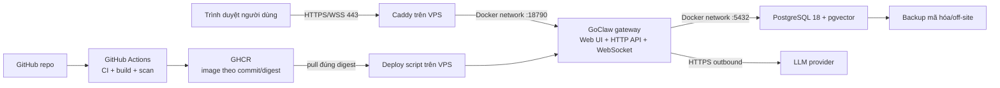

# Kế hoạch triển khai GoClaw lên VPS, GitHub và domain

Ngày lập: 2026-07-29

Trạng thái: Kế hoạch đã được khảo sát từ source; chưa triển khai VPS, DNS, GitHub hoặc production

Repo nguồn: `https://github.com/nextlevelbuilder/goclaw`

Snapshot khảo sát: `496b7ffce648e12380b913f92753cd0c6792ce76` (`dev`, tag `v3.15.0-beta.180`)

Bản stable hiện tại cần ưu tiên cho production: `v3.14.0` tại `2f3d68e806c11a20b59b0591bca75410ed1237f7`

## 1. Kết luận điều hành

Phương án đề xuất cho production:

1. Dùng bản stable được pin theo tag, commit và image digest; tại ngày khảo sát là `v3.14.0`.
2. Đưa source vào repo GitHub riêng của Sếp, giữ `upstream` trỏ về `nextlevelbuilder/goclaw`.
3. GitHub Actions chạy toàn bộ kiểm tra, build image có Web UI nhúng sẵn và đẩy image bất biến lên GHCR.
4. VPS chỉ pull đúng image digest đã được CI xác nhận; không build source trực tiếp trên VPS.
5. VPS chạy ba service chính bằng Docker Compose:
   - GoClaw gateway + Web UI nhúng;
   - PostgreSQL 18 + pgvector;
   - Caddy làm reverse proxy và cấp HTTPS tự động.
6. Chỉ Caddy được mở cổng `80/443`. GoClaw `18790` và PostgreSQL `5432` không được public.
7. Người dùng truy cập `https://<domain>`, đăng nhập lần đầu bằng:
   - User ID: `system`;
   - Gateway token: secret lưu trên VPS, không lưu trong Git.
8. Sau đăng nhập, cấu hình LLM provider trong Setup Wizard, tạo agent và chạy một lượt chat thật để xác nhận hệ thống dùng được từ đầu đến cuối.

Đây là kiến trúc mục tiêu:



## 2. “Xong việc” được định nghĩa thế nào

Chỉ được coi là hoàn tất khi toàn bộ các điều kiện sau cùng đạt:

- `https://<domain>` trả giao diện GoClaw hợp lệ, không có cảnh báo TLS.
- HTTP tự chuyển từ `80` sang HTTPS `443`.
- WebSocket `wss://<domain>/ws` kết nối và xác thực thành công.
- Đăng nhập bằng `system` + gateway token thành công.
- Setup Wizard tạo được ít nhất một provider và một agent.
- Một câu chat thật trả kết quả từ LLM, không chỉ dừng ở trang dashboard.
- `GET /health` trả `200`, đồng thời một API có xác thực như `GET /v1/agents` cũng trả thành công.
- PostgreSQL báo healthy, pgvector có mặt và schema đúng version của binary.
- Dữ liệu vẫn còn sau khi restart/recreate container.
- Backup chạy thành công và một bản backup đã được restore thử ở môi trường tách biệt.
- Cổng `5432`, `18790`, `6379`, `9222`, `16686` không truy cập được từ Internet.
- GitHub Actions lưu được commit SHA, image digest và bằng chứng deploy.
- Có rollback về image trước đó; nếu migration không tương thích ngược, có quy trình restore DB.
- Không có secret thật trong Git, GitHub Actions log, container log hoặc tài liệu.

## 3. Các phát hiện quan trọng từ source

### 3.1. Kiến trúc và runtime

- Backend dùng Go; source hiện yêu cầu Go `1.26.0` tại [`go.mod`](../go.mod).
- Web UI là React/Vite/TypeScript, dùng `pnpm`; image production có thể build UI rồi nhúng vào binary tại [`Dockerfile`](../Dockerfile).
- Standard/server edition dùng PostgreSQL và pgvector. Compose upstream dùng `pgvector/pgvector:pg18` tại [`docker-compose.postgres.yml`](../docker-compose.postgres.yml).
- Gateway, Web UI, REST API và WebSocket có thể cùng chạy trên cổng `18790`; không cần dựng một frontend server riêng cho bản triển khai cơ bản.
- WebSocket dùng route `/ws`; UI tự chuyển `https:` thành `wss:` tại [`ui/web/src/api/ws-client.ts`](../ui/web/src/api/ws-client.ts).
- Gateway có `GET /health`, nhưng code hiện chỉ trả JSON `{"status":"ok",...}` và không ping DB. Vì vậy `/health` là liveness, không đủ làm readiness production; phải kiểm thêm PostgreSQL và API có xác thực.

### 3.2. Nhánh và phiên bản

- Nhánh mặc định upstream là `dev`, đang phát hành prerelease liên tục.
- Snapshot `dev` được khảo sát là `v3.15.0-beta.180`, schema PostgreSQL yêu cầu version `95`.
- Bản stable mới nhất tại ngày khảo sát là `v3.14.0`, schema yêu cầu version `80`.
- Không được lấy mặc định `dev` để triển khai production chỉ vì `git clone` tự checkout nhánh đó.
- Trước ngày triển khai thật phải kiểm tra lại GitHub Releases; nếu có stable mới hơn `v3.14.0`, phải đọc changelog, migration và test trước khi đổi pin.

### 3.3. Bảo mật mặc định cần sửa cho VPS

- [`docker-compose.yml`](../docker-compose.yml) mặc định publish gateway ra host bằng cổng `18790`.
- [`docker-compose.postgres.yml`](../docker-compose.postgres.yml) mặc định publish PostgreSQL ra host bằng cổng `5432`.
- Hai mặc định này tiện cho local development nhưng không phù hợp khi dùng trực tiếp trên VPS public.
- Gateway bắt buộc có `GOCLAW_GATEWAY_TOKEN` khi bind non-loopback; code sẽ fail startup nếu token rỗng, trừ khi bật chế độ insecure rõ ràng.
- `GOCLAW_ALLOWED_ORIGINS` cần được khóa đúng `https://<domain>`; để trống sẽ cho mọi WebSocket origin.
- `GOCLAW_ENCRYPTION_KEY` mã hóa provider keys, MCP credentials và các secret lưu trong DB. Code chấp nhận:
  - 64 ký tự hex;
  - 44 ký tự base64 tương ứng 32 byte;
  - raw 32 byte.
- Mất `GOCLAW_ENCRYPTION_KEY` đồng nghĩa các secret đã mã hóa trong DB không thể đọc lại. Backup DB mà không backup khóa này là backup chưa hoàn chỉnh.
- Dashboard lưu token đăng nhập trong browser `localStorage` tại [`ui/web/src/stores/use-auth-store.ts`](../ui/web/src/stores/use-auth-store.ts). Vì vậy:
  - chỉ dùng HTTPS;
  - không đăng nhập trên thiết bị lạ;
  - ưu tiên browser pairing hoặc API key scope hẹp cho người dùng phụ;
  - gateway token chỉ dùng cho chủ hệ thống.

### 3.4. Persistence

Các dữ liệu cần giữ qua deploy/recreate:

- PostgreSQL volume: agent, session, tenant, provider, cấu hình và dữ liệu nghiệp vụ.
- GoClaw data volume: config runtime, package runtime, credential phụ trợ.
- Workspace volume: file ngữ cảnh, file người dùng, media và artifact.
- Skills volume nếu dùng custom skill.
- Caddy data/config volumes: certificate và ACME state.
- File secret môi trường trên VPS.

### 3.5. License là cổng bắt buộc

[`LICENSE`](../LICENSE) là `Creative Commons Attribution-NonCommercial 4.0 International`.

- Được chia sẻ/chỉnh sửa khi ghi công và dùng phi thương mại.
- Không được mặc định coi là được phép dùng thương mại.
- Nếu hệ thống phục vụ hoạt động kinh doanh, khách hàng, thu phí, bán dịch vụ hoặc mục đích thương mại khác, phải có xác nhận quyền sử dụng phù hợp từ chủ sở hữu trước khi go-live.
- Repo riêng, VPS riêng hoặc không bán source không tự động làm mất điều kiện `NonCommercial`.
- Đây là cổng pháp lý, không phải lỗi kỹ thuật; không được bỏ qua trong bước duyệt production.

## 4. Giả định thiết kế ban đầu

Kế hoạch dùng các giả định sau để không dừng ở mức chung chung:

- Một VPS Ubuntu 24.04 LTS hoặc Debian 12.
- Kiến trúc VPS là `amd64`; phải xác nhận bằng `uname -m`. Nếu `arm64`, workflow build phải đổi/mở rộng platform.
- Tối thiểu thực tế cho production nhỏ:
  - 2 vCPU;
  - 4 GB RAM;
  - 40 GB SSD;
  - 2 GB swap có kiểm soát.
- Một domain/subdomain riêng, ví dụ `goclaw.example.com`.
- Một node GoClaw + một PostgreSQL; chưa triển khai HA.
- Người dùng ban đầu là Sếp, đăng nhập với quyền owner.
- LLM provider được thêm qua dashboard sau khi hạ tầng chạy.
- Phase 1 chưa bật Redis, Jaeger, browser sidecar hoặc Docker sandbox.
- GitHub repo đích và GHCR có thể private; VPS có credential chỉ-đọc package.

Nếu thông tin thực tế khác, phase preflight phải cập nhật kế hoạch trước khi thay đổi server.

## 5. Kiến trúc Git và quản trị upstream

### 5.1. Remote và branch

Mô hình đề xuất:

```text
upstream = https://github.com/nextlevelbuilder/goclaw.git
origin   = git@github.com:<github-owner>/goclaw.git

production = nhánh đang deploy
main       = nhánh tích hợp ổn định của repo riêng
dev        = chỉ dùng nếu cần theo dõi upstream dev; không tự deploy
```

Quy trình tạo baseline:

```bash
git fetch upstream --tags --prune
git switch -c production v3.14.0
git push -u origin production
```

Tại thời điểm thực hiện, thay `v3.14.0` bằng stable mới hơn chỉ khi cổng đánh giá release đã pass.

### 5.2. Không dùng fork “nguyên trạng” để deploy

Các workflow upstream có release/beta và một số đường deploy riêng cho môi trường của tác giả. Repo riêng phải rà từng workflow trước khi bật Actions:

- giữ CI hữu ích;
- không cho workflow beta/release upstream tự phát hành từ repo riêng;
- không dùng workflow deploy `zuey` cho VPS của Sếp;
- không dùng mutable tag `latest` làm nguồn rollback;
- thêm workflow riêng cho branch `production`.

### 5.3. Đồng bộ upstream

Mỗi đợt nâng version:

1. Fetch upstream và tag mới.
2. Đọc release notes, changelog, migration và breaking changes.
3. Tạo branch `upgrade/vX.Y.Z`.
4. Rebase hoặc merge có kiểm soát trên branch đó.
5. Chạy full CI và deploy staging.
6. Backup/restore rehearsal.
7. PR vào `production`.
8. GitHub Environment yêu cầu duyệt thủ công trước deploy.

Không tự động merge `upstream/dev` vào production.

## 6. Cấu trúc file cần xây trong repo riêng

Đề xuất thêm các artifact sau:

```text
deploy/
├── compose.prod.yml
├── Caddyfile
├── env.production.example
├── README.md
├── scripts/
│   ├── bootstrap-vps.sh
│   ├── deploy-release.sh
│   ├── backup-postgres.sh
│   ├── restore-postgres.sh
│   ├── verify-production.sh
│   └── rotate-logs.sh
└── systemd/
    ├── goclaw-backup.service
    └── goclaw-backup.timer

.github/workflows/
├── production-ci.yml
├── production-image.yml
└── production-deploy.yml

docs/operations/
├── vps-runbook.md
├── backup-restore.md
├── upgrade-rollback.md
└── incident-response.md
```

### 6.1. `compose.prod.yml`

Nên là compose production độc lập thay vì merge trực tiếp compose upstream, vì merge danh sách `ports` rất dễ vô tình giữ lại cổng public.

Yêu cầu:

- `goclaw` dùng `image: ${GOCLAW_IMAGE}` theo digest.
- Không có `ports` cho `goclaw`.
- Không có `ports` cho `postgres`.
- Chỉ Caddy publish `80:80` và `443:443`.
- `goclaw` và `postgres` ở private Docker network.
- Caddy chỉ cần vào network frontend có `goclaw`.
- PostgreSQL chỉ ở backend network.
- Healthcheck:
  - GoClaw: `/health`;
  - PostgreSQL: `pg_isready`;
  - Caddy: HTTPS/domain từ bên ngoài ở bước verify.
- `restart: unless-stopped`.
- Giữ hardening hợp lý từ upstream:
  - `no-new-privileges`;
  - drop capabilities;
  - tmpfs `/tmp`;
  - PID/memory/CPU limits.
- Dùng Docker named volumes có tên cố định, không để đổi tên theo thư mục checkout.
- Giới hạn và rotate Docker logs.
- Không mount Docker socket trong phase đầu.

### 6.2. `Caddyfile`

Trách nhiệm:

- cấp và renew TLS tự động;
- redirect HTTP sang HTTPS;
- reverse proxy toàn bộ `/`, `/v1/*`, `/ws`;
- giữ WebSocket upgrade;
- gzip/zstd;
- gửi `Host`, `X-Forwarded-Proto`, `X-Forwarded-For`;
- security headers an toàn.

Không thêm CSP cứng ngay ở lần đầu vì có thể làm hỏng Web UI. Chỉ bật CSP sau khi test đầy đủ.

### 6.3. `env.production.example`

Chỉ chứa tên biến và placeholder:

```dotenv
GOCLAW_IMAGE=ghcr.io/<owner>/goclaw@sha256:<digest>
GOCLAW_DOMAIN=goclaw.example.com
GOCLAW_GATEWAY_TOKEN=<generate-on-vps>
GOCLAW_ENCRYPTION_KEY=<generate-on-vps>
GOCLAW_ALLOWED_ORIGINS=https://goclaw.example.com
GOCLAW_OWNER_IDS=system
POSTGRES_USER=goclaw
POSTGRES_DB=goclaw
POSTGRES_PASSWORD=<generate-on-vps>
GOCLAW_TRACE_VERBOSE=0
```

File thật là `/opt/goclaw/shared/.env`, mode `0600`, owner `root:goclaw`. Không copy file thật vào GitHub.

## 7. Kế hoạch thực hiện theo phase

## Phase 0 — Cổng pháp lý và thông tin đầu vào

Mục tiêu: không triển khai nhầm mục đích hoặc nhầm tài sản.

Thông tin cần chốt:

- mục đích dùng phi thương mại hay thương mại;
- quyền sử dụng nếu có yếu tố thương mại;
- domain/subdomain;
- nhà quản lý DNS;
- IP VPS, SSH port, user và quyền sudo;
- VPS architecture;
- GitHub owner/repo đích;
- repo/image public hay private;
- LLM provider dự kiến;
- nhu cầu Telegram/Discord/WhatsApp;
- nhu cầu chạy code, browser automation, Redis/OTel;
- RPO/RTO mong muốn.

Gate hoàn thành:

- license đã được chấp nhận/phê duyệt;
- không có secret gửi qua chat;
- domain, VPS và GitHub target không còn mơ hồ.

## Phase 1 — Preflight VPS chỉ đọc

Mục tiêu: hiểu hiện trạng trước khi thay đổi.

Kiểm tra:

```bash
uname -a
uname -m
cat /etc/os-release
id
sudo -n true
df -h
free -h
lsblk
ip addr
ss -lntup
systemctl --failed
docker version
docker compose version
timedatectl
```

Phải lập inventory:

- service đang chạy;
- port đang dùng;
- firewall hiện tại;
- dung lượng và inode;
- Docker/container/volume cũ;
- domain nào đang trỏ về VPS;
- kernel update/reboot pending;
- backup/snapshot hiện có.

Trước thay đổi:

- tạo snapshot tại nhà cung cấp VPS;
- ghi UTC, snapshot ID và thời điểm;
- xác nhận đường truy cập console/rescue;
- không sửa trực tiếp nếu SSH/sudo chưa ổn.

Gate hoàn thành:

- SSH key login pass;
- `sudo -n true` pass hoặc có cơ chế sudo được cấp rõ ràng;
- snapshot đã tạo;
- không có xung đột port/dữ liệu chưa xử lý.

## Phase 2 — Chuẩn hóa repo GitHub riêng

Mục tiêu: source có lịch sử rõ và không phụ thuộc nhánh beta mặc định.

Các bước:

1. Tạo repo GitHub đích.
2. Đặt remote `upstream` và `origin` đúng vai trò.
3. Tạo branch `production` từ stable tag.
4. Audit toàn bộ `.github/workflows`.
5. Thêm deploy artifacts ở mục 6.
6. Thêm `.env.production.example`, tuyệt đối không thêm `.env`.
7. Bật branch protection:
   - PR bắt buộc;
   - CI bắt buộc pass;
   - chặn force-push;
   - chặn delete branch;
   - Environment `production` cần approval.
8. Bật Dependabot/Renovate nếu phù hợp, nhưng không auto-deploy major upgrade.
9. Bật secret scanning/push protection nếu GitHub plan hỗ trợ.

Gate hoàn thành:

- origin/upstream đúng;
- source stable được pin;
- repo không có secret;
- workflow upstream không mong muốn đã bị khóa;
- branch protection hoạt động.

## Phase 3 — Xây CI production

Mục tiêu: chỉ image đã kiểm chứng mới được publish.

CI phải chạy:

```bash
go build ./...
go build -tags sqliteonly ./...
go vet ./...
go test -race -timeout=5m ./...
go test -race -timeout=90s -tags integration ./tests/invariants/...
go test -race -timeout=180s -tags integration ./tests/integration/

cd ui/web
pnpm install --frozen-lockfile
pnpm lint
pnpm test
pnpm build
```

Lưu ý:

- Dùng Go version từ `go.mod`.
- Dùng Node 22 và pnpm version được pin trong `ui/web/package.json`.
- PostgreSQL test dùng `pgvector/pgvector:pg18`.
- Contract test không được “pass giả” bằng `continue-on-error` trong production gate; cần dựng gateway test hoặc đánh dấu rõ là chưa chạy.
- Thêm secret scan trên toàn commit/PR.
- Thêm dependency/image vulnerability scan.
- Không in DSN, token, API key hoặc private key ra log.

Gate hoàn thành:

- backend, UI, invariant và integration pass;
- không có High/Critical vulnerability chưa được chấp nhận có lý do;
- build reproducible ở commit SHA cụ thể.

## Phase 4 — Build và publish image GHCR

Mục tiêu: tạo artifact bất biến, truy vết được.

Tag đề xuất:

```text
ghcr.io/<owner>/goclaw:sha-<full-or-short-sha>
ghcr.io/<owner>/goclaw:v3.14.0-custom.1
```

Deploy phải dùng:

```text
ghcr.io/<owner>/goclaw@sha256:<digest>
```

Build args:

```text
ENABLE_EMBEDUI=true
ENABLE_PYTHON=true
ENABLE_OTEL=false
ENABLE_FULL_SKILLS=false
VERSION=v3.14.0-custom.1+<sha>
```

Yêu cầu:

- build đúng platform VPS;
- nếu chưa biết/không đồng nhất, build `linux/amd64,linux/arm64`;
- OCI labels có source URL, revision, version, license;
- xuất SBOM/provenance nếu GitHub plan hỗ trợ;
- scan image trước deploy;
- không dùng `latest` làm bằng chứng production;
- image private thì VPS chỉ có quyền `read:packages`.

Gate hoàn thành:

- digest đã được ghi vào job summary;
- image pull được bằng credential chỉ-đọc;
- image smoke test pass.

## Phase 5 — Hardening VPS

Mục tiêu: tạo nền tảng an toàn, có thể vận hành.

Thực hiện:

- update OS và reboot nếu kernel yêu cầu;
- tạo user/service account riêng;
- SSH chỉ dùng key;
- tắt password login và root login sau khi đã xác minh console + user sudo;
- cài Docker Engine/Compose từ repository chính thức;
- không đưa deploy user vào `docker` group nếu có thể;
- dùng sudoers chỉ cho `/usr/local/sbin/goclaw-deploy`;
- deploy script phải validate image chỉ thuộc `ghcr.io/<owner>/goclaw@sha256:<64-hex>`;
- UFW/nftables:
  - default deny incoming;
  - allow SSH đúng port, ưu tiên giới hạn IP quản trị;
  - allow `80/tcp`, `443/tcp`;
  - không allow `18790`, `5432`, `6379`, `9222`, `16686`;
- bật fail2ban nếu SSH public;
- cấu hình Docker log rotation;
- đồng bộ giờ NTP;
- tạo `/opt/goclaw/{releases,shared,backups}` với permission tối thiểu.

Gate hoàn thành:

- scan port từ máy ngoài chỉ thấy port dự kiến;
- deploy user không có quyền shell/root rộng hơn cần thiết;
- Docker và firewall survive reboot.

## Phase 6 — Tạo secret và stack lần đầu

Mục tiêu: khởi động stack không để lộ secret.

Secret sinh trực tiếp trên VPS:

```bash
openssl rand -hex 32   # GOCLAW_ENCRYPTION_KEY
openssl rand -hex 32   # GOCLAW_GATEWAY_TOKEN
openssl rand -hex 32   # POSTGRES_PASSWORD
```

Quy tắc:

- `GOCLAW_ALLOW_INSECURE_NO_AUTH` không được đặt.
- `GOCLAW_ALLOWED_ORIGINS=https://<domain>`.
- `GOCLAW_TRACE_VERBOSE=0` ở production.
- Không đặt LLM key trong compose file.
- Có thể nhập LLM key qua dashboard sau khi đăng nhập; key sẽ được mã hóa trong DB.
- Lưu `GOCLAW_ENCRYPTION_KEY` thêm một bản trong password manager/secrets manager ngoài VPS.

Khởi động:

1. Pull image theo digest.
2. Start PostgreSQL.
3. Chờ `pg_isready`.
4. Chạy upgrade/migration bằng đúng image sẽ deploy.
5. Start GoClaw.
6. Chờ container healthy.
7. Start Caddy.

Gate hoàn thành:

- tất cả container healthy;
- schema status đúng;
- restart stack không mất dữ liệu;
- log không có secret thô.

## Phase 7 — DNS và HTTPS

Mục tiêu: domain trỏ đúng và TLS hợp lệ.

DNS:

- tạo `A` record từ subdomain tới IPv4 VPS;
- chỉ tạo `AAAA` khi VPS có IPv6 hoạt động và firewall IPv6 đã cấu hình;
- TTL `300` trong cutover, tăng sau khi ổn định;
- nếu dùng Cloudflare Proxy, chốt rõ chế độ SSL `Full (strict)`;
- không bật hai reverse proxy/tunnel chồng nhau khi chưa có lý do.

TLS:

- Caddy phải lấy certificate thành công;
- kiểm tra SAN đúng domain;
- kiểm tra auto-renew;
- redirect HTTP → HTTPS;
- chỉ bật HSTS sau khi HTTPS đã ổn định và không còn subdomain phụ bị ảnh hưởng.

Verify:

```bash
dig +short <domain> A
curl -I http://<domain>
curl -fsS https://<domain>/health
openssl s_client -connect <domain>:443 -servername <domain>
```

Gate hoàn thành:

- DNS đúng;
- certificate hợp lệ;
- không có mixed content;
- WebSocket `wss` hoạt động qua reverse proxy.

## Phase 8 — Đăng nhập và onboarding chức năng

Mục tiêu: Sếp chỉ cần vào domain để sử dụng, không cần SSH cho thao tác thường ngày.

Luồng:

1. Mở `https://<domain>`.
2. Đăng nhập:
   - User ID `system`;
   - gateway token lấy từ kho secret.
3. Setup Wizard:
   - thêm provider;
   - chọn model;
   - test provider;
   - tạo agent đầu tiên;
   - channel có thể bỏ qua.
4. Mở Chat.
5. Gửi một yêu cầu thật.
6. Xác nhận response, usage và trace.

Baseline khuyên dùng API key provider trước. Luồng ChatGPT/Codex OAuth có callback riêng và phải kiểm tra kỹ trong mô hình VPS/domain; không dùng OAuth làm điều kiện duy nhất để chứng minh hạ tầng chạy ở lần đầu.

Gate hoàn thành:

- provider test pass;
- agent tạo thành công;
- chat thật trả kết quả;
- refresh/re-login vẫn dùng được.

## Phase 9 — GitHub Actions deploy tự động có kiểm soát

Mục tiêu: deploy lặp lại được, không SSH thủ công mỗi lần.

Trigger:

- merge vào `production`, hoặc
- `workflow_dispatch` với image digest/tag đã tồn tại.

Không deploy trực tiếp từ pull request.

GitHub Environment secrets/variables:

| Tên | Loại | Mục đích |
|---|---|---|
| `VPS_HOST` | secret | Host/IP VPS |
| `VPS_PORT` | variable | SSH port |
| `VPS_USER` | variable | Deploy user |
| `VPS_SSH_PRIVATE_KEY_B64` | secret | CI-only key, base64 một dòng |
| `VPS_HOST_KEY` | secret/variable | Pinned known_hosts entry |
| `GOCLAW_DOMAIN` | variable | Domain public |

Không đưa các secret runtime sau vào GitHub nếu không cần:

- gateway token;
- encryption key;
- PostgreSQL password;
- LLM provider key;
- channel bot token.

Deploy job:

1. Xác nhận image digest thuộc commit vừa pass CI.
2. Kết nối SSH với host key pinning; không dùng `StrictHostKeyChecking=no`.
3. Gọi remote deploy script với digest.
4. Remote script dùng `flock` để chống hai deploy cùng lúc.
5. Tạo pre-deploy DB backup.
6. Pull image mới.
7. Chạy migration dry/status nếu binary hỗ trợ.
8. Apply migration.
9. Recreate GoClaw.
10. Chờ health.
11. Chạy API smoke có auth bằng token chỉ có trên VPS.
12. Chạy external HTTPS + WebSocket smoke từ runner.
13. Ghi deployed SHA/digest/time.
14. Nếu fail, chạy rollback theo mục 11.

Gate hoàn thành:

- GitHub job xanh;
- deployed digest trên VPS trùng digest GHCR;
- smoke test trong và ngoài VPS cùng pass.

## Phase 10 — Backup, restore và retention

Mục tiêu: phục hồi được, không chỉ có file backup.

### 10.1. PostgreSQL

- Dùng `pg_dump -Fc`.
- Chạy hằng ngày.
- Chạy bắt buộc trước mỗi deploy có migration.
- Mã hóa trước khi đẩy off-site.
- Retention đề xuất:
  - 7 bản ngày;
  - 4 bản tuần;
  - 6 bản tháng.

### 10.2. File/volume

Backup:

- data volume;
- workspace volume;
- skills volume;
- Caddy state khi cần;
- manifest image digest;
- config không-secret.

`GOCLAW_ENCRYPTION_KEY` phải backup tách biệt trong password manager. Không nhét khóa chung vào cùng bucket backup DB nếu bucket đó là điểm lỗi duy nhất.

### 10.3. Restore rehearsal

Ít nhất mỗi quý, tốt hơn mỗi tháng:

1. Tạo DB/container tách biệt.
2. Restore bản dump.
3. Start đúng image tương ứng.
4. Kiểm schema.
5. Đăng nhập/API smoke.
6. Xác nhận provider encrypted credential đọc được bằng đúng encryption key.
7. Ghi thời gian restore thực tế.

Mục tiêu đề xuất:

- RPO thường: không quá 24 giờ;
- RPO trước deploy: gần 0 nhờ pre-deploy backup;
- RTO single VPS: 30–60 phút sau khi runbook đã được rehearsal.

## Phase 11 — Monitoring và cảnh báo

Theo dõi:

- HTTPS uptime;
- certificate expiry;
- container health/restart count;
- PostgreSQL `pg_isready`;
- authenticated API smoke;
- CPU/RAM/load;
- disk và inode;
- Docker volume growth;
- backup age/size;
- log `security.*`;
- LLM provider 401/429/5xx;
- migration/schema mismatch.

Ngưỡng khởi đầu:

- disk cảnh báo 70%, nghiêm trọng 85%;
- RAM sustained >85%;
- container restart >3 lần/10 phút;
- backup quá 26 giờ;
- TLS còn dưới 14 ngày;
- `/health` fail 2–3 lần liên tiếp;
- authenticated API fail dù `/health` vẫn `200`.

Điểm đặc biệt: `/health` hiện không chứng minh DB hoạt động, nên monitoring chỉ ping `/health` là thiếu.

## Phase 12 — Nghiệm thu giao diện và thiết bị

Trên PC, tablet và mobile:

- mở domain và login;
- đi hết Setup Wizard;
- tạo provider/agent;
- gửi chat;
- kiểm các trang Overview, Chat, Agents, Providers, Config;
- scroll toàn trang ở từng viewport;
- kiểm modal, dropdown, input khi bàn phím ảo bật;
- kiểm không có footer/action bị che;
- reload trang sâu như `/chat/...` không trả 404;
- kiểm console không có lỗi quan trọng;
- kiểm WebSocket reconnect sau khi tắt/bật mạng;
- kiểm logout xóa trạng thái truy cập.

Browser tối thiểu:

- Chrome/Edge desktop;
- Safari macOS/iOS;
- Chrome Android.

## 8. Các thành phần chưa bật ở phase đầu

### Docker sandbox

Upstream sandbox overlay mount `/var/run/docker.sock`, tương đương trao quyền rất lớn lên Docker host.

Chỉ bật khi:

- thật sự cần agent chạy code;
- đã đánh giá threat model;
- ưu tiên isolated worker VPS, Docker-in-Docker hoặc runtime cách ly;
- network mặc định off;
- workspace access tối thiểu;
- CPU/RAM/PID/timeout được khóa.

Không bật sandbox chỉ để “đủ tính năng”.

### Browser sidecar

Chỉ bật sau baseline. CDP port `9222` phải ở private Docker network, không public.

### Redis

Không cần cho single-node nhỏ ở ngày đầu. Nếu bật, không publish `6379`.

### Jaeger/OTel

Hữu ích cho debug nhưng tăng footprint. Nếu bật, Jaeger UI không public; chỉ vào qua VPN/SSH tunnel.

### Cloudflare Tunnel

Là phương án thay Caddy/public port khi domain dùng Cloudflare và muốn không mở inbound. Upstream đã có overlay tách `TUNNEL_TOKEN` khỏi env của app. Chỉ chọn một đường:

- Caddy + `80/443`, hoặc
- Cloudflare Tunnel.

Không chạy cả hai nếu chưa thiết kế route rõ.

## 9. Ma trận secret

| Secret | Nơi tạo | Nơi lưu | Có lên GitHub không | Backup |
|---|---|---|---|---|
| `GOCLAW_GATEWAY_TOKEN` | VPS | `/opt/goclaw/shared/.env` + password manager | Không | Có |
| `GOCLAW_ENCRYPTION_KEY` | VPS | `.env` + password manager độc lập | Không | Bắt buộc |
| `POSTGRES_PASSWORD` | VPS | `.env` | Không | Có |
| LLM provider key | Dashboard hoặc VPS | DB mã hóa / env | Không | Qua DB + encryption key |
| Channel token | Dashboard/VPS | DB mã hóa / env | Không | Có theo policy |
| CI SSH private key | Máy quản trị | GitHub Environment Secret dạng base64 | Chỉ secret store | Có |
| GHCR pull token | GitHub/machine user | VPS Docker credential store | Không | Có/rotate |
| Caddy ACME state | Caddy | Docker volume | Không | Có thể tái cấp; backup tùy RTO |

## 10. Kiểm thử bắt buộc trước go-live

### 10.1. Source/CI

- Go build PostgreSQL edition.
- Go build SQLite edition để bắt lỗi cross-edition.
- Go vet.
- Unit test race.
- Tenant invariant test.
- Integration test với pgvector.
- Web lint/test/build.
- Secret scan.
- Dependency/image vulnerability scan.

### 10.2. Container

- Image chạy đúng architecture.
- Main gateway process hạ quyền về user `goclaw`.
- Healthcheck pass.
- Recreate giữ dữ liệu.
- Resource limit được áp dụng.
- Không có port ngoài ý muốn.

### 10.3. Database

- `pg_isready` pass.
- Extension `vector` tồn tại.
- Schema version đúng binary.
- Migration từ backup copy pass.
- `pg_dump` pass.
- `pg_restore --list` pass.
- Restore rehearsal pass.

### 10.4. HTTP/WebSocket

- HTTP → HTTPS.
- TLS chain hợp lệ.
- `/` trả Web UI.
- `/health` trả `200`.
- `/v1/agents` không token trả `401`.
- `/v1/agents` đúng token trả `200`.
- `/ws` connect đúng token pass.
- Origin lạ bị từ chối.
- Upload/SSE/long response không bị reverse proxy cắt.

### 10.5. End-to-end

- Login `system`.
- Add provider.
- Provider test.
- Create agent.
- Chat thật.
- Restart stack.
- Chat lại với dữ liệu/session còn nguyên.

## 11. Rollback

### 11.1. Trường hợp không có migration

1. Đổi image digest về digest trước.
2. `docker compose up -d`.
3. Chờ health.
4. Chạy authenticated API + WebSocket smoke.
5. Ghi incident.

### 11.2. Trường hợp đã migration

Không được mặc định chạy binary cũ trên schema mới.

1. Stop gateway.
2. Giữ nguyên failed DB để điều tra.
3. Tạo DB sạch hoặc volume DB phục hồi.
4. Restore pre-deploy dump.
5. Khôi phục đúng encryption key.
6. Chạy image digest trước deploy.
7. Verify schema, login, API, chat.
8. Chỉ mở traffic sau khi pass.

### 11.3. Trường hợp lỗi domain/TLS

- Không sửa DNS liên tục thiếu kiểm soát.
- Kiểm A/AAAA, Caddy log, firewall và ACME.
- Có thể tạm rollback DNS về endpoint cũ nếu endpoint cũ còn hợp lệ.
- Không tắt HTTPS để “chạy tạm” gateway token qua HTTP public.

## 12. Rủi ro chính và cách kiểm soát

| Rủi ro | Mức | Kiểm soát |
|---|---:|---|
| Vi phạm license do dùng thương mại | Critical | Cổng pháp lý trước go-live |
| Deploy nhầm `dev` beta | High | Pin stable tag + SHA + image digest |
| Public PostgreSQL/gateway port | Critical | Compose production độc lập; scan port ngoài VPS |
| Mất encryption key | Critical | Backup tách biệt + restore rehearsal |
| Migration làm binary cũ không chạy | High | Pre-deploy DB dump + rollback có restore |
| GitHub Actions lộ secret | High | Runtime secret chỉ ở VPS; redact log; secret scan |
| Mutable image tag làm rollback sai | High | Deploy theo digest |
| `/health` xanh nhưng DB chết | High | Thêm DB + authenticated API probe |
| Docker socket bị agent chiếm quyền | Critical | Không bật sandbox phase 1; cách ly khi cần |
| VPS thiếu RAM/disk | Medium/High | 4 GB RAM, monitor, log rotation, retention |
| OAuth callback không hợp VPS | Medium | Baseline bằng provider API key; OAuth là phase riêng |
| Upstream drift phá file deploy riêng | Medium | PR upgrade + parity audit + staging |
| Repo fork chạy nhầm workflow upstream | High | Audit/tắt workflow release/deploy không dùng |

## 13. Thứ tự thực hiện tối ưu

1. Xác nhận license/mục đích.
2. Nhận domain, VPS, GitHub target nhưng không nhận secret qua chat.
3. Preflight VPS read-only + snapshot.
4. Tạo repo riêng từ stable tag.
5. Xây compose/Caddy/scripts/workflows/runbook.
6. Chạy full CI.
7. Build/push image GHCR theo digest.
8. Hardening VPS.
9. Tạo secret trực tiếp trên VPS.
10. Start Postgres → migration → GoClaw → Caddy.
11. DNS/TLS.
12. Login + provider + agent + chat E2E.
13. Backup + restore rehearsal.
14. Bật monitoring.
15. Nghiệm thu responsive/browser.
16. Sau khi baseline ổn định mới cân nhắc browser/sandbox/Redis/OTel/channels.

## 14. Ước lượng công việc

Nếu VPS, domain, DNS và GitHub access đã sẵn:

- khảo sát/preflight và snapshot: 0,5–1 giờ;
- chuẩn hóa repo + deploy artifacts + CI/CD: 3–5 giờ;
- bootstrap/hardening VPS: 1–2 giờ;
- deploy/DNS/TLS: 1–2 giờ;
- onboarding + E2E + responsive: 1–2 giờ;
- backup/restore rehearsal + runbook: 1–2 giờ.

Tổng thực tế: khoảng 7,5–14 giờ, chưa tính thời gian chờ DNS, cấp quyền, xử lý license hoặc lỗi riêng của VPS/provider.

## 15. Trạng thái hiện tại

Đã làm:

- clone repo về `/Users/bexaycop/cop/goclaw`;
- xác nhận upstream, branch, tag và commit;
- đọc kiến trúc, Dockerfile, compose, auth, Web UI login, health route, security, CI/release, migration và license;
- xác định stable/beta;
- xây kế hoạch end-to-end.

Chưa làm:

- chưa tạo repo GitHub riêng;
- chưa commit/push;
- chưa có thông tin/truy cập VPS;
- chưa thay DNS;
- chưa deploy;
- chưa tạo secret;
- chưa chạy build/test runtime local vì máy hiện tại không có Go, Docker và pnpm;
- chưa live-verify domain, TLS, WebSocket, provider hoặc chat.

## 16. Nguồn đối chiếu

Nguồn local đã khóa snapshot:

- [`README.md`](../README.md)
- [`AGENTS.md`](../AGENTS.md)
- [`Dockerfile`](../Dockerfile)
- [`docker-compose.yml`](../docker-compose.yml)
- [`docker-compose.postgres.yml`](../docker-compose.postgres.yml)
- [`docker-compose.cloudflared.yml`](../docker-compose.cloudflared.yml)
- [`.env.example`](../.env.example)
- [`prepare-env.sh`](../prepare-env.sh)
- [`Makefile`](../Makefile)
- [`internal/config/config_load.go`](../internal/config/config_load.go)
- [`internal/crypto/aes.go`](../internal/crypto/aes.go)
- [`internal/gateway/server.go`](../internal/gateway/server.go)
- [`ui/web/src/api/ws-client.ts`](../ui/web/src/api/ws-client.ts)
- [`ui/web/src/stores/use-auth-store.ts`](../ui/web/src/stores/use-auth-store.ts)
- [`.github/workflows/ci.yaml`](../.github/workflows/ci.yaml)
- [`.github/workflows/fork-image.yaml`](../.github/workflows/fork-image.yaml)
- [`LICENSE`](../LICENSE)

Nguồn upstream/live:

- `https://github.com/nextlevelbuilder/goclaw`
- `https://github.com/nextlevelbuilder/goclaw/releases`
- `https://docs.goclaw.sh/`
- `https://docs.goclaw.sh/llms.txt`
